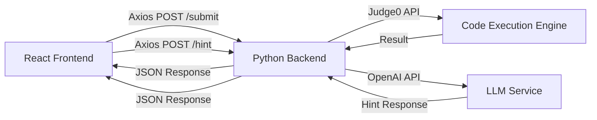

# System Architecture

## 2.1 High-Level Design

The AI Tutor is a full-stack web application that provides adaptive Python programming instruction through a 4-level progressive hint system. The system evaluates student-submitted code and delivers personalized hints based on the OpenAI GPT-4o-mini model.



### Components

| Component | Technology | Purpose |
|-----------|------------|---------|
| Frontend | React 18 + Vite | User interface, code editor, hint display |
| Backend | FastAPI + SQLAlchemy | API endpoints, business logic, authentication |
| Database | PostgreSQL | Persistent storage for sessions, exercises, hints, quizzes, surveys |
| Code Execution | Judge0 CE / FastPythonSandbox | Secure execution of student code |
| LLM Service | OpenAI GPT-4o-mini | Generation of adaptive hints (L3/L4) |

## 2.2 Data Flow

### Code Submission Flow

1. **Capture**: Student writes Python code in the Monaco Editor component (`CodeEditor.tsx`)

2. **Serialize**: Frontend sends POST request to `/api/v1/submit` via Axios:
   ```typescript
   api.post('/submit', {
     session_id: sessionId,
     exercise_id: exerciseId,
     code: sourceCode,
     language_id: 71,  // Python 3 (Judge0 language ID)
     elapsed_seconds: elapsedSeconds,
   })
   ```

3. **Validate**: Backend (`submit.py`) performs:
   - JWT authentication via `get_current_user` dependency
   - Rate limiting check (60 submissions/minute)
   - Session ownership verification
   - Code syntax validation via `validate_code_syntax()`

4. **Execute**: Code is evaluated based on `correct_criteria.type`:
   - `code_execution`: Runs against test cases via `evaluate_code()`
   - `llm_judge`: Rubric-based token matching
   - `exact_match`: Direct string comparison

5. **Return**: JSON response includes:
   ```json
   {
     "is_correct": true,
     "hints_used": 2
   }
   ```

6. **Render**: Frontend updates UI with ResultBadge showing success/failure

### Hint System Flow

1. Student clicks "Get Hint" button
2. Frontend POSTs to `/api/v1/hint/` with session_id and exercise_id
3. Backend (`hints.py`) advances the HintEngine state machine:
   - **L1/L2**: Returns pre-authored hints from database immediately
   - **L3/L4**: Builds prompt from YAML template, calls LLM, validates for leakage
4. Validated hint is returned and displayed in HintPanel

## 2.3 Auth Flow

### JWT Token Lifecycle

```
┌──────────────┐     POST /session/start     ┌──────────────┐
│   Frontend   │ ──────────────────────────▶ │   Backend    │
│   (Login)    │                             │  (auth.py)   │
└──────────────┘                             └──────────────┘
       │                                            │
       │  1. Create session in DB                   │
       │  2. Generate JWT pair (access + refresh)    │
       │  3. Return tokens in SessionResponse        │
       │◀────────────────────────────────────────────│
       │                                            │
       ▼                                            ▼
┌──────────────┐                             ┌──────────────┐
│  localStorage │ ──── store tokens ────▶ │   Database   │
│  access_token │                             │   sessions   │
│  refresh_token│                             │    table     │
└──────────────┘                             └──────────────┘
```

### Token Configuration

| Token | Expiry | Storage |
|-------|--------|---------|
| Access Token | 60 minutes | localStorage |
| Refresh Token | 7 days | localStorage |

### Request Authentication

All protected endpoints use the `get_current_user` FastAPI dependency:

```python
async def submit_answer(
    body: SubmitRequest,
    current_user: TokenData = Depends(get_current_user),
) -> SubmitResponse:
```

The authAPI interceptor automatically attaches the token:

```typescript
api.interceptors.request.use((config) => {
  const token = localStorage.getItem('access_token');
  if (token) {
    config.headers['Authorization'] = `Bearer ${token}`;
  }
  return config;
});
```

### Token Refresh Flow

On 401 response, the interceptor attempts to refresh the token:

```typescript
// If refresh fails, redirect to login
localStorage.removeItem('access_token');
localStorage.removeItem('refresh_token');
window.location.href = '/login';
```

## 2.4 Tech Stack

| Layer | Technology | Version | Notes |
|-------|------------|---------|-------|
| **Frontend** | | | |
| Framework | React | 18.3.1 | Core UI library |
| Build Tool | Vite | 5.4.19 | Fast development server |
| Language | TypeScript | 5.6.3 | Type safety |
| Routing | React Router | 6.30.1 | SPA navigation |
| HTTP Client | Axios | 1.9.0 | API communication |
| Editor | Monaco Editor | 4.7.0 | Code editing |
| Styling | Tailwind CSS | 3.4.16 | Utility-first CSS |
| **Backend** | | | |
| Framework | FastAPI | 0.115.0+ | Async REST API |
| Language | Python | 3.12+ | Core application |
| ORM | SQLAlchemy | 2.0.36+ | Database abstraction |
| Database | PostgreSQL | — | Primary data store |
| Migrations | Alembic | 1.14.0+ | Schema versioning |
| Validation | Pydantic | 2.10.0+ | Data validation |
| Auth | python-jose | 3.3.0+ | JWT handling |
| Hashing | passlib | 1.7.4+ | Password hashing |
| HTTP Client | httpx | 0.28.1+ | Async HTTP calls |
| **External Services** | | | |
| Code Execution | Judge0 CE | — | Via RapidAPI or self-hosted |
| LLM | OpenAI GPT-4o-mini | — | Hint generation (L3/L4) |
| Caching | Redis | 5.2.0+ | Session and hint caching |
| **Development** | | | |
| Testing | pytest | 8.3.0+ | Backend test framework |
| Linting | ruff | 0.8.0+ | Python linting |
| Formatting | Prettier | 3.3.3+ | Frontend formatting |

## 2.5 Gaps & Assumptions

### Unlocated Modules

The following referenced modules could not be located in the codebase:

- `backend/services/answer_evaluator.py` — Referenced in `backend/services/__init__.py` but file not found
- `backend/services/secure_sandbox.py` — Referenced in submit.py but full file not reviewed
- `backend/services/output_validator.py` — Referenced in hints.py but full file not reviewed
- `backend/services/prompt_builder.py` — Referenced in hints.py but full file not reviewed
- `backend/services/llm_client.py` — Referenced but full implementation not reviewed
- `backend/services/cache_service.py` — Referenced but full implementation not reviewed
- `backend/services/logging_service.py` — Referenced but full implementation not reviewed
- `backend/services/rate_limiter.py` — Referenced but full implementation not reviewed
- `backend/services/metrics.py` — Referenced in main.py but not reviewed
- `backend/exceptions.py` — Referenced but not reviewed

### Inferred Behaviors

The following behaviors were inferred from usage patterns rather than direct observation:

1. **Judge0 Integration**: The code references `evaluate_code()` from services but the actual Judge0 API call mechanism was not fully traced
2. **LLM Caching**: Hints for L3/L4 are cached for 1 hour (`await cache.set(cache_key, hint_text, ttl=3600)`)
3. **Rate Limiting**: Separate limits for general submissions (60/min) vs LLM hints (10/min)
4. **Session Groups**: Sessions are tagged as 'tutor' or 'control' for A/B testing in the thesis study

### Questions for Future Contributors

1. **Secure Sandbox**: How does `secure_sandbox.py` differ from `python_sandbox.py`? Are both in use?
2. **Output Validator**: What specific patterns trigger the leakage detection?
3. **Prompt Templates**: Where are the YAML hint templates stored? (`backend/prompts/`)
4. **Redis Configuration**: Is Redis required for all deployments or optional?
5. **Judge0 Deployment**: Is the RapidAPI proxy required or can self-hosted Judge0 be used?

### Missing Documentation

- No `backend/prompts/` directory found — unclear where hint templates are stored
- No `.env.example` file found — environment variables documented only in README
- No API rate limit documentation beyond code comments
